6. Praktikum 1: Membuat Project Flutter Baru

Langkah 1:
Buka VS Code, lalu tekan tombol Ctrl + Shift + P maka akan tampil Command Palette, lalu ketik Flutter. Pilih New Application Project.

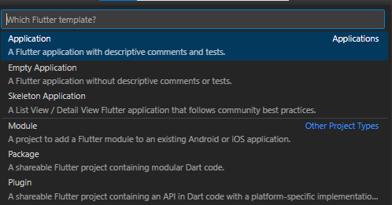

Langkah 2:
Kemudian buat folder sesuai style laporan praktikum yang Anda pilih. Disarankan pada folder dokumen atau desktop atau alamat folder lain yang tidak terlalu dalam atau panjang. Lalu pilih Select a folder to create the project in.

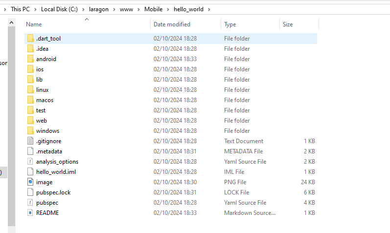

Langkah 3:
Buat nama project flutter hello_world seperti berikut, lalu tekan Enter. Tunggu hingga proses pembuatan project baru selesai.

Langkah 4:
Jika sudah selesai proses pembuatan project baru, pastikan tampilan seperti berikut. Pesan akan tampil berupa "Your Flutter Project is ready!" artinya Anda telah berhasil membuat project Flutter baru.

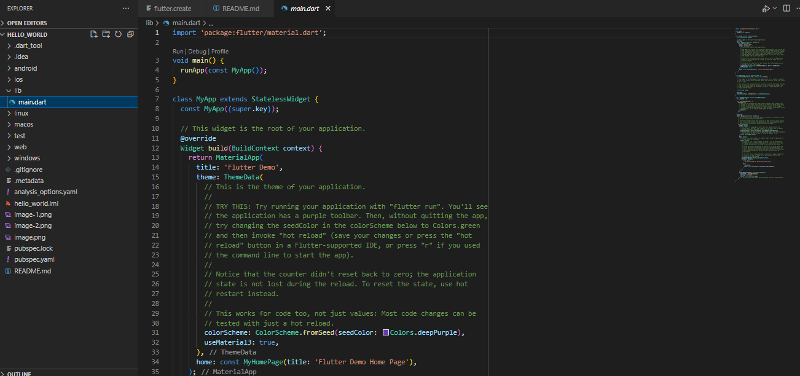

7. Praktikum 2: Menghubungkan Perangkat Android atau Emulator

Langkah 1:
Mengaktifkan proses debug USB

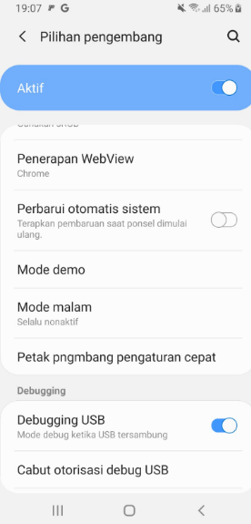

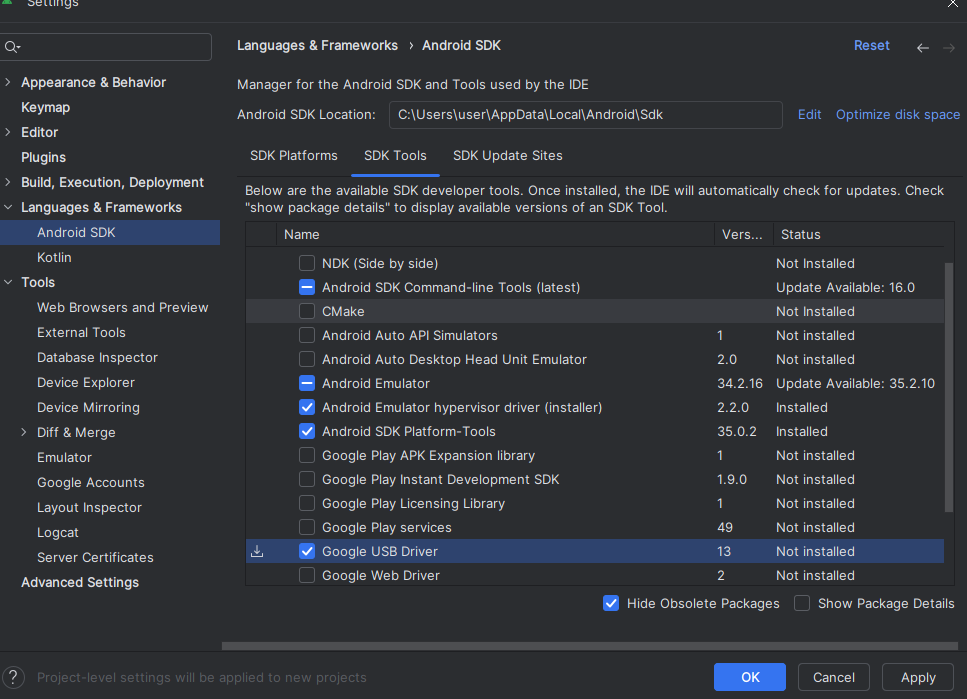

Langkah 2:
Menjalankan aplikasi di perangkat Android menggunakan kabel

8. Praktikum 3: Membuat Repository GitHub dan Laporan Praktikum

Langkah 1:
Login ke akun GitHub Anda, lalu buat repository baru dengan nama "flutter-fundamental-part1"

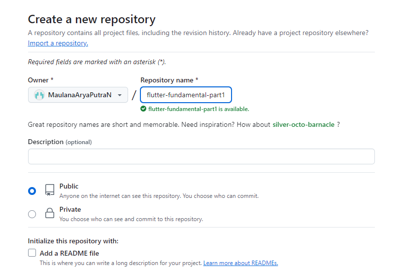

Langkah 2:
Lalu klik tombol "Create repository" lalu akan tampil seperti gambar berikut.

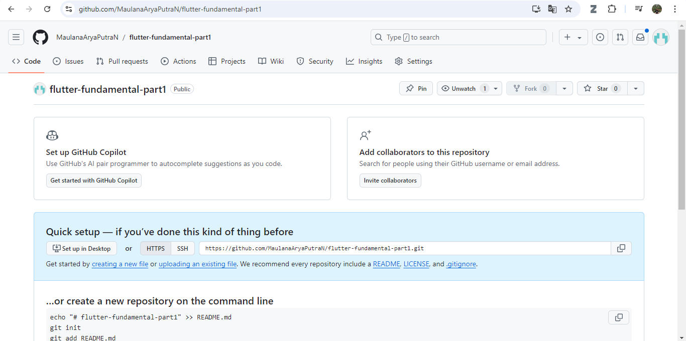

Langkah 3:
Kembali ke VS code, project flutter hello_world, buka terminal pada menu Terminal > New Terminal. Lalu ketik perintah berikut untuk inisialisasi git pada project Anda.

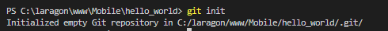

Langkah 4:
Pilih menu Source Control di bagian kiri, lalu lakukan stages (+) pada file .gitignore untuk mengunggah file pertama ke repository GitHub.

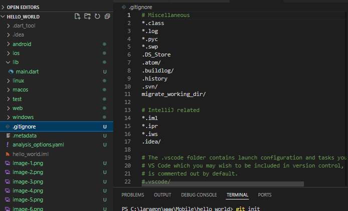

Langkah 5:
Beri pesan commit "tambah gitignore" lalu klik Commit (✔)

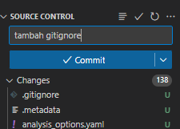

Langkah 6:
Lakukan push dengan klik bagian menu titik tiga > Push

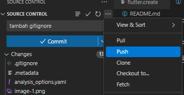

Langkah 7:
Di pojok kanan bawah akan tampil seperti gambar berikut. Klik "Add Remote"

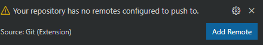

Langkah 8:
Salin tautan repository Anda dari browser ke bagian ini, lalu klik Add remote

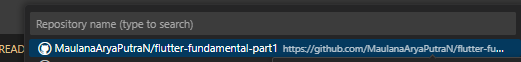

Setelah berhasil, tulis remote name dengan "origin"

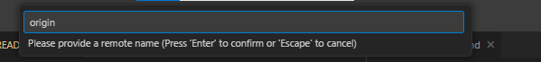

Langkah 9:
Lakukan hal yang sama pada file README.md mulai dari Langkah 4. Setelah berhasil melakukan push, masukkan username GitHub Anda dan password berupa token yang telah dibuat (pengganti password konvensional ketika Anda login di browser GitHub). Reload halaman repository GitHub Anda, maka akan tampil hasil push kedua file tersebut seperti gambar berikut.

